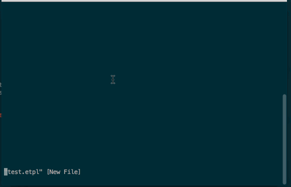

# vim-etpl

vim etpl syntax

## basic

默认仅支持`.etpl`后缀，如果你想在其他后缀中使用，很简单，指定一行modeline就行：

```html
<!-- vim: set ft=etpl ts=4 sw=4 sts=4 tw=120 fdm=indent: -->
```


## customize

可以通过配置以下选项改变etpl的起始串和结束串，比如类似mustache：

```viml
" 默认为`<!--`
let g:etpl_command_open='{{#'
" 默认为`-->`
let g:etpl_command_close='}}'

" 默认`${`
let g:etpl_variable_open='<%'
" 默认`}`
let g:etpl_variable_close='%>'
```



当然，不能保证所有配置都能work！

## snippets

Make sure you have [SirVer/ultisnips](https://github.com/SirVer/ultisnips) installed.


## matchit

Make sure you have [vim-scripts/matchit.zip](https://github.com/vim-scripts/matchit.zip) installed.


