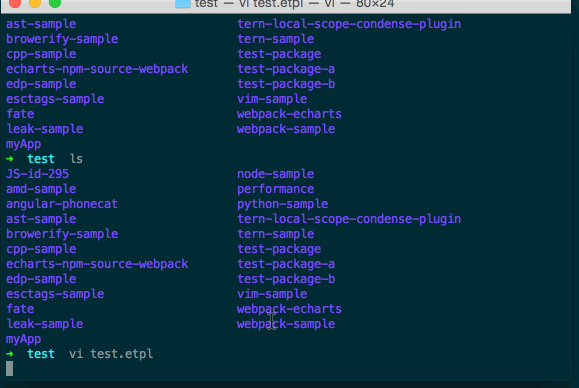
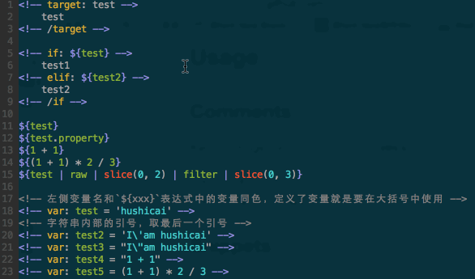

# vim-etpl

vim etpl syntax

默认仅支持`.etpl`后缀，如果你想在其他后缀中使用，很简单，指定一行modeline就行：

```html
<!-- vim: set ft=etpl ts=4 sw=4 sts=4 tw=120 fdm=indent: -->
```

## snippets

Make sure you have [SirVer/ultisnips](https://github.com/SirVer/ultisnips) installed.

## TODO

* key binding
* ...

## 示例

### basic


### snippets



### matchit


