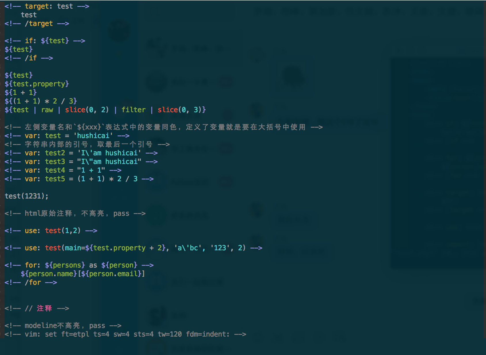

# vim-etpl

vim etpl syntax

默认仅支持etpl后缀，目前如果想在其他后缀中使用，可以使用vim的modeline指定为etpl。

## snippets

Make sure you have [SirVer/ultisnips](https://github.com/SirVer/ultisnips) installed.

## TODO

* 颜色调整
* 参数高亮
* key binding
* matchit
* ...

## 示例

